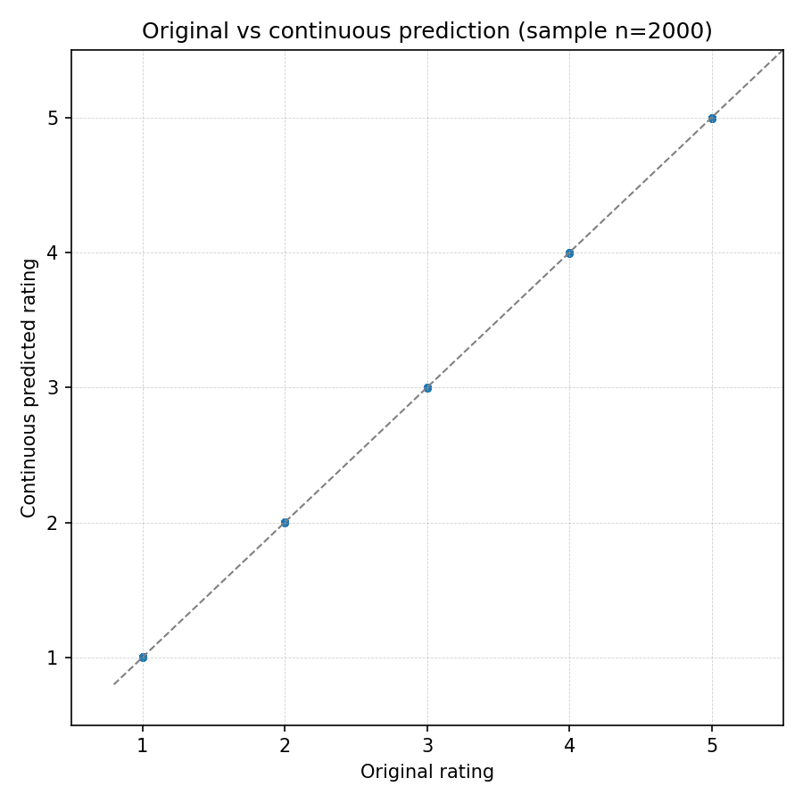
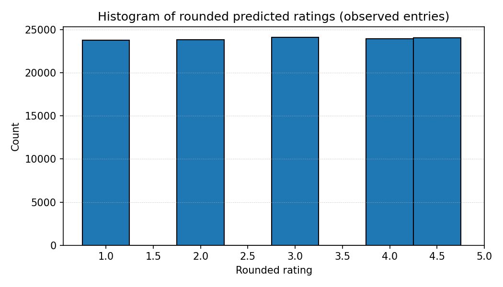
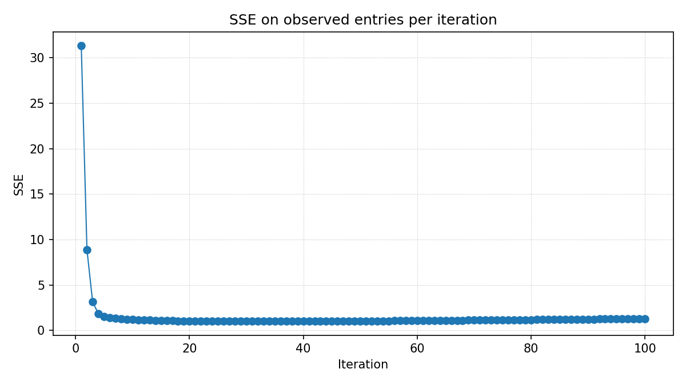

# ALS_Algorithm
Babak-Yousefian-DSS-T2

# just run the runner.
#### @author by : babak

---
---
---

### ___```original_vs_predicted_scatter```___



---

### ___```predicted_histogram```___



---

### ___```sse_history```___



---

### ___```and_here_is_outputs```___

```bash

---(venv) ➜  EX2 git:(master) ✗ ./runner.sh 
====== @Author by: babak yousefian ======
====== run is starting...!!! ======
Loaded matrix matrix_1000x200_sparse40.csv shape (1001, 200) (items x users)
Iter 1/100 - SSE: 31.323587 (time: 2.41s)
Iter 2/100 - SSE: 8.876297 (time: 2.34s)
Iter 3/100 - SSE: 3.130627 (time: 2.42s)
Iter 4/100 - SSE: 1.854065 (time: 3.41s)
Iter 5/100 - SSE: 1.529970 (time: 6.06s)
Iter 6/100 - SSE: 1.397167 (time: 6.12s)
Iter 7/100 - SSE: 1.320073 (time: 4.91s)
Iter 8/100 - SSE: 1.266472 (time: 2.84s)
Iter 9/100 - SSE: 1.225546 (time: 2.51s)
Iter 10/100 - SSE: 1.192622 (time: 2.55s)
Iter 11/100 - SSE: 1.165290 (time: 2.46s)
Iter 12/100 - SSE: 1.142139 (time: 3.17s)
Iter 13/100 - SSE: 1.122266 (time: 2.69s)
Iter 14/100 - SSE: 1.105048 (time: 2.44s)
Iter 15/100 - SSE: 1.090037 (time: 2.78s)
Iter 16/100 - SSE: 1.076895 (time: 2.87s)
Iter 17/100 - SSE: 1.065360 (time: 2.70s)
Iter 18/100 - SSE: 1.055223 (time: 2.93s)
Iter 19/100 - SSE: 1.046316 (time: 2.55s)
Iter 20/100 - SSE: 1.038500 (time: 2.60s)
Iter 21/100 - SSE: 1.031660 (time: 2.50s)
Iter 22/100 - SSE: 1.025696 (time: 2.86s)
Iter 23/100 - SSE: 1.020525 (time: 2.82s)
Iter 24/100 - SSE: 1.016075 (time: 2.54s)
Iter 25/100 - SSE: 1.012282 (time: 2.53s)
Iter 26/100 - SSE: 1.009094 (time: 3.27s)
Iter 27/100 - SSE: 1.006460 (time: 3.00s)
Iter 28/100 - SSE: 1.004338 (time: 2.55s)
Iter 29/100 - SSE: 1.002690 (time: 2.82s)
Iter 30/100 - SSE: 1.001483 (time: 3.24s)
Iter 31/100 - SSE: 1.000685 (time: 2.84s)
Iter 32/100 - SSE: 1.000268 (time: 2.59s)
Iter 33/100 - SSE: 1.000209 (time: 2.87s)
Iter 34/100 - SSE: 1.000483 (time: 2.92s)
Iter 35/100 - SSE: 1.001070 (time: 3.03s)
Iter 36/100 - SSE: 1.001951 (time: 4.43s)
Iter 37/100 - SSE: 1.003108 (time: 2.79s)
Iter 38/100 - SSE: 1.004525 (time: 3.02s)
Iter 39/100 - SSE: 1.006187 (time: 3.17s)
Iter 40/100 - SSE: 1.008080 (time: 2.75s)
Iter 41/100 - SSE: 1.010192 (time: 2.49s)
Iter 42/100 - SSE: 1.012509 (time: 2.52s)
Iter 43/100 - SSE: 1.015022 (time: 2.54s)
Iter 44/100 - SSE: 1.017718 (time: 2.55s)
Iter 45/100 - SSE: 1.020589 (time: 2.52s)
Iter 46/100 - SSE: 1.023625 (time: 2.51s)
Iter 47/100 - SSE: 1.026817 (time: 3.34s)
Iter 48/100 - SSE: 1.030158 (time: 3.06s)
Iter 49/100 - SSE: 1.033638 (time: 3.44s)
Iter 50/100 - SSE: 1.037252 (time: 3.10s)
Iter 51/100 - SSE: 1.040992 (time: 2.77s)
Iter 52/100 - SSE: 1.044850 (time: 3.15s)
Iter 53/100 - SSE: 1.048822 (time: 2.89s)
Iter 54/100 - SSE: 1.052901 (time: 2.76s)
Iter 55/100 - SSE: 1.057081 (time: 2.78s)
Iter 56/100 - SSE: 1.061357 (time: 2.69s)
Iter 57/100 - SSE: 1.065724 (time: 3.23s)
Iter 58/100 - SSE: 1.070176 (time: 2.97s)
Iter 59/100 - SSE: 1.074710 (time: 2.91s)
Iter 60/100 - SSE: 1.079320 (time: 2.93s)
Iter 61/100 - SSE: 1.084002 (time: 3.12s)
Iter 62/100 - SSE: 1.088752 (time: 2.80s)
Iter 63/100 - SSE: 1.093566 (time: 2.90s)
Iter 64/100 - SSE: 1.098440 (time: 3.03s)
Iter 65/100 - SSE: 1.103371 (time: 2.80s)
Iter 66/100 - SSE: 1.108355 (time: 2.97s)
Iter 67/100 - SSE: 1.113389 (time: 2.95s)
Iter 68/100 - SSE: 1.118469 (time: 2.45s)
Iter 69/100 - SSE: 1.123592 (time: 2.61s)
Iter 70/100 - SSE: 1.128756 (time: 2.45s)
Iter 71/100 - SSE: 1.133957 (time: 2.48s)
Iter 72/100 - SSE: 1.139193 (time: 2.46s)
Iter 73/100 - SSE: 1.144461 (time: 2.62s)
Iter 74/100 - SSE: 1.149758 (time: 2.58s)
Iter 75/100 - SSE: 1.155083 (time: 2.42s)
Iter 76/100 - SSE: 1.160431 (time: 2.48s)
Iter 77/100 - SSE: 1.165803 (time: 2.76s)
Iter 78/100 - SSE: 1.171194 (time: 2.41s)
Iter 79/100 - SSE: 1.176603 (time: 2.65s)
Iter 80/100 - SSE: 1.182027 (time: 2.49s)
Iter 81/100 - SSE: 1.187466 (time: 2.50s)
Iter 82/100 - SSE: 1.192917 (time: 2.43s)
Iter 83/100 - SSE: 1.198378 (time: 2.47s)
Iter 84/100 - SSE: 1.203847 (time: 2.41s)
Iter 85/100 - SSE: 1.209323 (time: 2.43s)
Iter 86/100 - SSE: 1.214803 (time: 2.41s)
Iter 87/100 - SSE: 1.220287 (time: 3.66s)
Iter 88/100 - SSE: 1.225773 (time: 2.44s)
Iter 89/100 - SSE: 1.231260 (time: 2.50s)
Iter 90/100 - SSE: 1.236745 (time: 2.58s)
Iter 91/100 - SSE: 1.242228 (time: 2.63s)
Iter 92/100 - SSE: 1.247707 (time: 2.42s)
Iter 93/100 - SSE: 1.253181 (time: 2.55s)
Iter 94/100 - SSE: 1.258649 (time: 2.43s)
Iter 95/100 - SSE: 1.264110 (time: 2.51s)
Iter 96/100 - SSE: 1.269562 (time: 2.64s)
Iter 97/100 - SSE: 1.275004 (time: 2.53s)
Iter 98/100 - SSE: 1.280436 (time: 2.49s)
Iter 99/100 - SSE: 1.285856 (time: 2.63s)
Iter 100/100 - SSE: 1.291263 (time: 2.48s)
ALS completed in 283.02s; iterations run: 100

--- Summary ---
k = 202, lambda = 0.1, iterations run = 100
SSE (continuous predictions): 1.291263, RMSE: 0.003282
SSE (rounded -> nearest 0.5, clipped [1,5]): 2452645.000000, RMSE: 4.523804
Saved rounded predicted matrix: prediction_csv/predicted_matrix_rounded.csv
Saved SSE history CSV: prediction_csv/sse_history.csv
Saved sample rows CSV: prediction_csv/sample_original_vs_predictions.csv

--- Sample original vs predictions (random sample) ---
┏━━━━━━━┳━━━━━━━┳━━━━━━━━━━┳━━━━━━━━━━━━━━━━━━━━┳━━━━━━━━━━━━━━┓
┃ item  ┃ user  ┃ original ┃ pred_continuous    ┃ pred_rounded ┃
┡━━━━━━━╇━━━━━━━╇━━━━━━━━━━╇━━━━━━━━━━━━━━━━━━━━╇━━━━━━━━━━━━━━┩
│ 1.0   │ 3.0   │ 1.0      │ 1.0049222064102548 │ 1.0          │
│ 97.0  │ 121.0 │ 4.0      │ 3.99742712781803   │ 4.0          │
│ 557.0 │ 20.0  │ 1.0      │ 1.0040409282194687 │ 1.0          │
│ 512.0 │ 121.0 │ 3.0      │ 2.9961812260036544 │ 3.0          │
│ 185.0 │ 16.0  │ 3.0      │ 3.0002110497302095 │ 3.0          │
│ 408.0 │ 72.0  │ 5.0      │ 4.995665493020047  │ 5.0          │
│ 372.0 │ 193.0 │ 2.0      │ 2.0011846194757066 │ 2.0          │
│ 575.0 │ 163.0 │ 3.0      │ 2.9994096657544764 │ 3.0          │
│ 118.0 │ 136.0 │ 1.0      │ 1.002062844810502  │ 1.0          │
│ 901.0 │ 8.0   │ 4.0      │ 3.9976307017155768 │ 4.0          │
│ 821.0 │ 50.0  │ 3.0      │ 3.0002695998865994 │ 3.0          │
│ 216.0 │ 118.0 │ 2.0      │ 2.002471385347206  │ 2.0          │
│ 299.0 │ 115.0 │ 2.0      │ 2.001812241788653  │ 2.0          │
│ 514.0 │ 97.0  │ 3.0      │ 2.997434982546655  │ 3.0          │
│ 671.0 │ 59.0  │ 1.0      │ 1.0044902315351294 │ 1.0          │
│ 424.0 │ 50.0  │ 5.0      │ 4.995594803187572  │ 5.0          │
│ 629.0 │ 172.0 │ 2.0      │ 1.9999438068503543 │ 2.0          │
│ 19.0  │ 56.0  │ 4.0      │ 3.998804651644027  │ 4.0          │
│ 271.0 │ 180.0 │ 5.0      │ 4.997202396189974  │ 5.0          │
│ 905.0 │ 130.0 │ 4.0      │ 3.999018460830044  │ 4.0          │
└───────┴───────┴──────────┴────────────────────┴──────────────┘
Saved SSE plot: prediction_csv/sse_history.png
Saved prediction histogram: prediction_csv/predicted_histogram.png
Saved original vs predicted scatter: prediction_csv/original_vs_predicted_scatter.png
Saved reproducer script stub: data_python/als_solution.py
====== Done.! ======
(venv) ➜  EX2 git:(master) ✗ 


```


